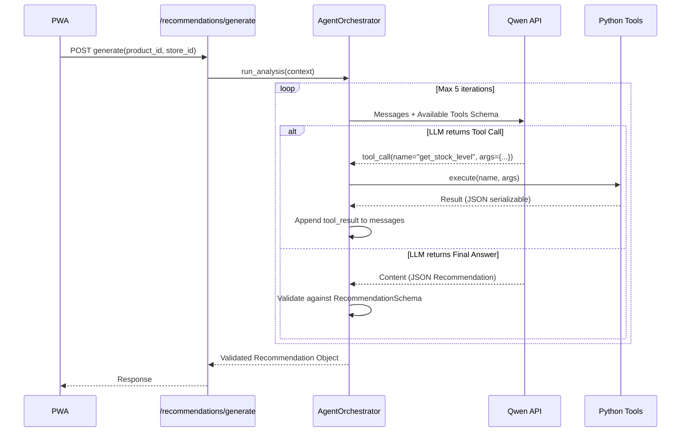

# Цикл Tool Calling (Sequence Diagram)

> Связано с SDD: `SDD.md` §3.2.1. Контекст: §3.2.3 (набор Tools), §6.1 (контракт ответа).

```mermaid
sequenceDiagram
    participant Client as PWA
    participant API as /recommendations/generate
    participant Agent as AgentOrchestrator
    participant LLM as Qwen API
    participant Tools as Python Tools
    
    Client->>API: POST generate(product_id, store_id)
    API->>Agent: run_analysis(context)
    
    loop Max 5 iterations
        Agent->>LLM: Messages + Available Tools Schema
        alt LLM returns Tool Call
            LLM-->>Agent: tool_call(name="get_stock_level", args={...})
            Agent->>Tools: execute(name, args)
            Tools-->>Agent: Result (JSON serializable)
            Agent->>Agent: Append tool_result to messages
        else LLM returns Final Answer
            LLM-->>Agent: Content (JSON Recommendation)
            Agent->>Agent: Validate against RecommendationSchema
        end
    end
    
    Agent-->>API: Validated Recommendation Object
    API-->>Client: Response
```
