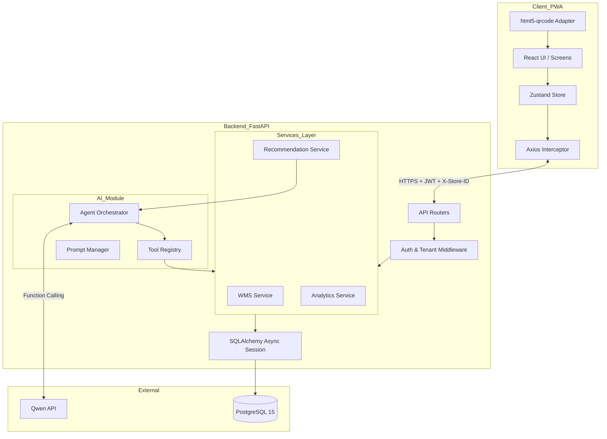

# Диаграмма компонентов (C4 Level 2)

> Связано с SDD: `SDD.md` §2.2.

```mermaid
graph TD
    subgraph Client_PWA
        UI[React UI / Screens]
        State[Zustand Store]
        APIClient[Axios Interceptor]
        Scanner[html5-qrcode Adapter]
    end

    subgraph Backend_FastAPI
        Router[API Routers]
        AuthMW[Auth & Tenant Middleware]
        
        subgraph Services_Layer
            WMSService[WMS Service]
            RecService[Recommendation Service]
            AnalyticsService[Analytics Service]
        end
        
        subgraph AI_Module
            AgentOrchestrator[Agent Orchestrator]
            ToolRegistry[Tool Registry]
            PromptManager[Prompt Manager]
        end
        
        DBLayer[SQLAlchemy Async Session]
    end

    subgraph External
        PG[(PostgreSQL 15)]
        LLM[Qwen API]
    end

    UI --> State
    State --> APIClient
    Scanner --> UI
    APIClient <-->|HTTPS + JWT + X-Store-ID| Router
    Router --> AuthMW
    AuthMW --> Services_Layer
    RecService --> AgentOrchestrator
    AgentOrchestrator <-->|Function Calling| LLM
    AgentOrchestrator --> ToolRegistry
    ToolRegistry --> Services_Layer
    Services_Layer --> DBLayer
    DBLayer --> PG
```
