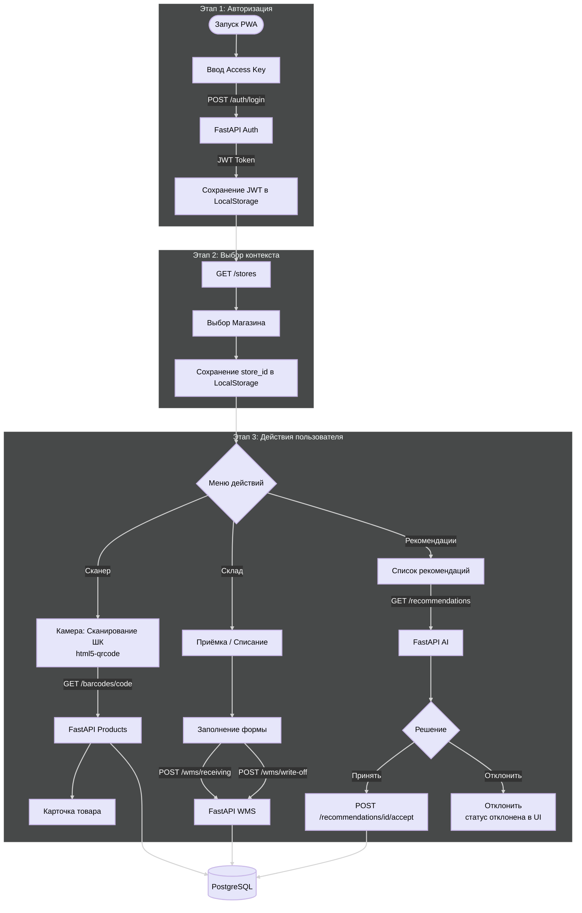

```mermaid
%%{init: {'theme':'dark', 'themeVariables': { 'primaryColor':'#E6E6FA', 'primaryTextColor':'black', 'lineColor':'lightgrey', 'edgeLabelBackground':'#333', 'tertiaryColor':'black', 'background':'transparent'}, 'themeCSS': '.edgeLabel, .edgeLabel p, .edgeLabel rect { background-color: #474949 !important; fill: #474949 !important; }', 'flowchart': {'curve':'basis'}}}%%

graph TB
    classDef default fill:#E6E6FA,color:black,stroke:#C9B8E8,stroke-width:2px;

    subgraph Auth [Этап 1: Авторизация]
        Start([Запуск PWA]):::default
        InputKey[Ввод Access Key]:::default
        API_Auth[FastAPI Auth]:::default
        StoreToken[Сохранение JWT в LocalStorage]:::default

        Start --> InputKey
        InputKey -->|POST /auth/login| API_Auth
        API_Auth -->|JWT Token| StoreToken
    end

    subgraph Context [Этап 2: Выбор контекста]
        LoadStores[GET /stores]:::default
        SelectStore[Выбор Магазина]:::default
        SaveContext[Сохранение store_id в LocalStorage]:::default

        StoreToken --> LoadStores
        LoadStores --> SelectStore
        SelectStore --> SaveContext
    end

    subgraph Action [Этап 3: Действия пользователя]
        Menu{Меню действий}:::default
        Scan[Камера: Сканирование ШК<br/>html5-qrcode]:::default
        API_Prod[FastAPI Products]:::default
        Card[Карточка товара]:::default
        StockOp[Приёмка / Списание]:::default
        Form[Заполнение формы]:::default
        API_WMS[FastAPI WMS]:::default
        RecList[Список рекомендаций]:::default
        API_Rec[FastAPI AI]:::default
        Decision{Решение}:::default
        Accept[POST /recommendations/id/accept]:::default
        Reject[Отклонить<br/>статус отклонена в UI]:::default

        SaveContext --> Menu

        Menu -->|Сканер| Scan
        Scan -->|GET /barcodes/code| API_Prod
        API_Prod --> Card

        Menu -->|Склад| StockOp
        StockOp --> Form
        Form -->|POST /wms/receiving| API_WMS
        Form -->|POST /wms/write-off| API_WMS

        Menu -->|Рекомендации| RecList
        RecList -->|GET /recommendations| API_Rec
        API_Rec --> Decision
        Decision -->|Принять| Accept
        Decision -->|Отклонить| Reject
    end

    DB[(PostgreSQL)]:::default

    API_WMS --> DB
    Accept --> DB
    API_Prod --> DB

    linkStyle default stroke:lightgrey,stroke-width:2px,color:white;
```
