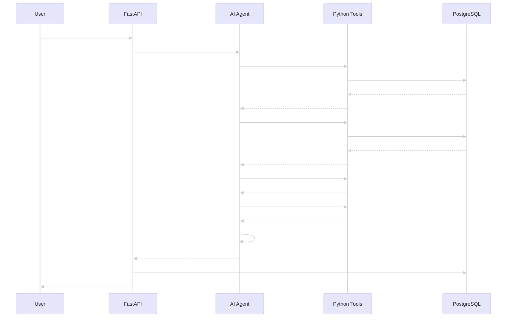

```mermaid
%%{init: {'theme':'dark', 'themeVariables': {'actorBkg':'#E6E6FA', 'actorBorder':'#C9B8E8', 'actorTextColor':'#333', 'signalColor':'#CCC', 'signalTextColor':'#FFF', 'noteBkgColor':'#444', 'noteTextColor':'#FFF'}}}%%

sequenceDiagram
    participant User
    participant API as FastAPI
    participant Agent as AI Agent
    participant Tools as Python Tools
    participant DB as PostgreSQL
    
    User->>API: POST /recommendations/generate
    API->>Agent: Generate recommendation for store_id=1
    Agent->>Tools: get_stock_level(product_id=42)
    Tools->>DB: SELECT quantity FROM inventory WHERE...
    DB-->>Tools: {quantity: 5, batch_date: ...}
    Tools-->>Agent: Stock data
    
    Agent->>Tools: get_sales_trend(product_id=42, days=14)
    Tools->>DB: Aggregate sales history
    DB-->>Tools: Trend data
    Tools-->>Agent: Sales trend
    
    Agent->>Tools: check_external_factors(date=today)
    Tools-->>Agent: Weather=holiday, multiplier=1.3
    
    Agent->>Tools: calculate_reorder_amount(...)
    Tools-->>Agent: Reorder qty=50
    
    Agent->>Agent: Formulate JSON + reasoning
    Agent-->>API: Structured Recommendation
    API->>DB: Save recommendation (status=pending)
    API-->>User: Recommendation response
```