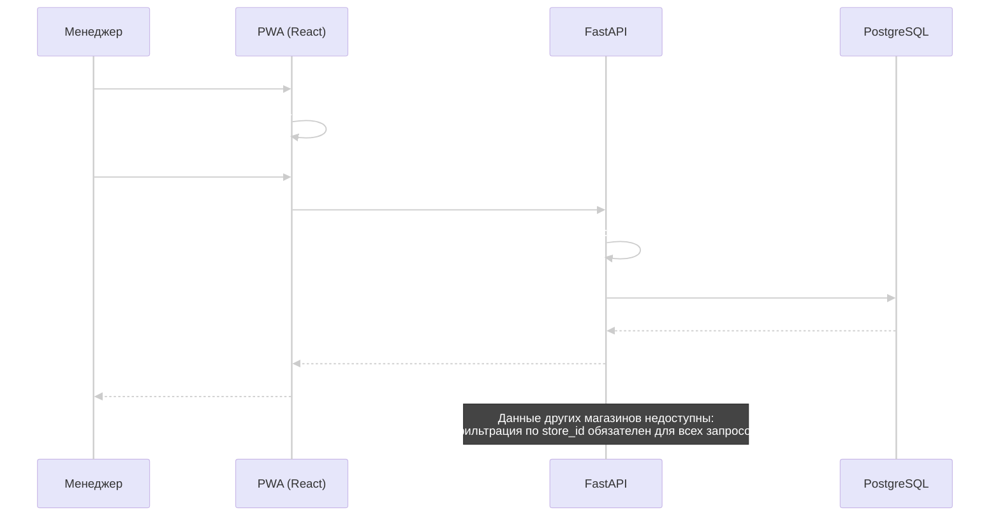

```mermaid
%%{init: {'theme':'dark', 'themeVariables': {'actorBkg':'#E6E6FA', 'actorBorder':'#C9B8E8', 'actorTextColor':'#333', 'signalColor':'#CCC', 'signalTextColor':'#FFF', 'noteBkgColor':'#444', 'noteTextColor':'#FFF'}}}%%

sequenceDiagram
    participant User as Менеджер
    participant App as PWA (React)
    participant API as FastAPI
    participant DB as PostgreSQL

    User->>App: Select Store "Магазин #1"
    App->>App: Save store_id=1 to LocalStorage

    User->>App: Request "Отчёт по остаткам"
    App->>API: GET /inventory (Headers: Bearer JWT, X-Store-ID: 1)

    API->>API: Verify JWT (TenantMiddleware: token store_ids vs X-Store-ID)
    API->>DB: SELECT * FROM inventory WHERE store_id=1

    DB-->>API: Filtered Data
    API-->>App: JSON Response
    App-->>User: Display Stock for Магазин #1

    Note over API: Данные других магазинов недоступны:<br/>фильтрация по store_id обязателен для всех запросов
```
