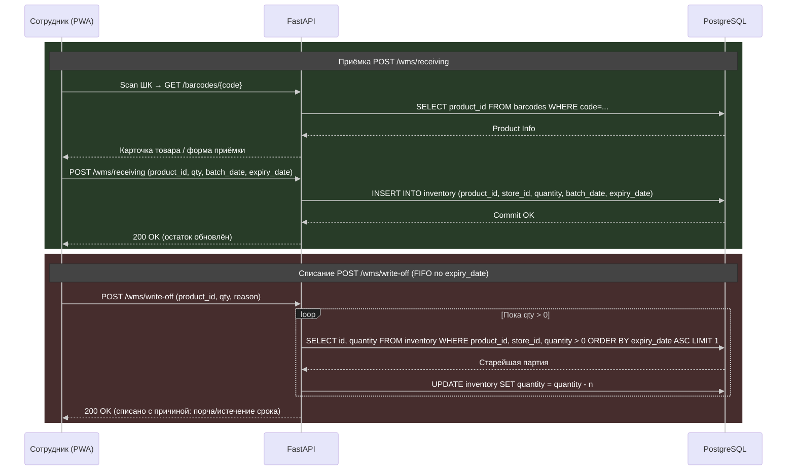

```mermaid
%%{init: {'theme':'dark', 'themeVariables': {'actorBkg':'#E6E6FA', 'actorBorder':'#C9B8E8', 'actorTextColor':'#333', 'signalColor':'#CCC', 'signalTextColor':'#FFF', 'noteBkgColor':'#444', 'noteTextColor':'#FFF'}}}%%

sequenceDiagram
    participant Staff as Сотрудник (PWA)
    participant API as FastAPI
    participant DB as PostgreSQL

    rect rgb(40, 60, 40)
        Note over Staff, DB: Приёмка POST /wms/receiving
        Staff->>API: Scan ШК → GET /barcodes/{code}
        API->>DB: SELECT product_id FROM barcodes WHERE code=...
        DB-->>API: Product Info
        API-->>Staff: Карточка товара / форма приёмки

        Staff->>API: POST /wms/receiving (product_id, qty, batch_date, expiry_date)
        API->>DB: INSERT INTO inventory (product_id, store_id, quantity, batch_date, expiry_date)
        DB-->>API: Commit OK
        API-->>Staff: 200 OK (остаток обновлён)
    end

    rect rgb(70, 45, 45)
        Note over Staff, DB: Списание POST /wms/write-off (FIFO по expiry_date)
        Staff->>API: POST /wms/write-off (product_id, qty, reason)
        loop Пока qty > 0
            API->>DB: SELECT id, quantity FROM inventory WHERE product_id, store_id, quantity > 0 ORDER BY expiry_date ASC LIMIT 1
            DB-->>API: Старейшая партия
            API->>DB: UPDATE inventory SET quantity = quantity - n
        end
        API-->>Staff: 200 OK (списано с причиной: порча/истечение срока)
    end
```
